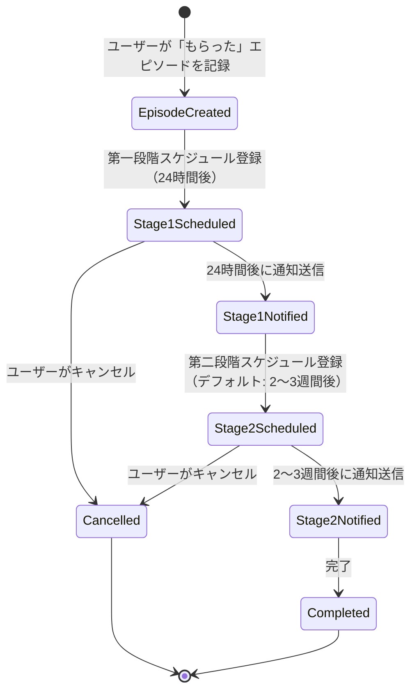
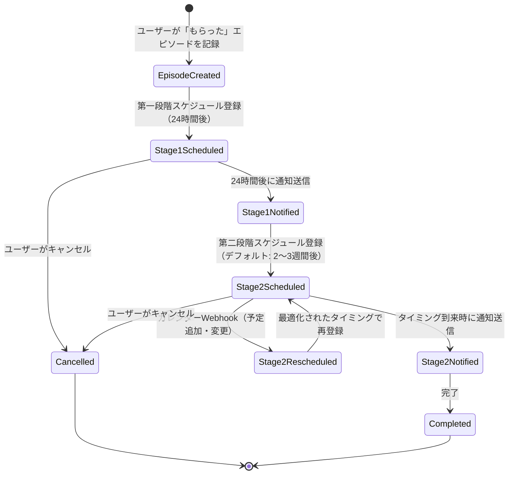

# 返報性ハックのタイミング計算ロジック詳細設計

**作成日**: 2026-05-09  
**目的**: Units Generation前に返報性ハックの実装複雑性を軽減するため、タイミング計算ロジックの詳細設計を行う

---

## 1. 概要

返報性ハック（二段階返報ロジック）は、社会的マナーに基づく「時差」通知ロジックを実装する。

### 1.1 二段階返報ロジック

| 段階 | タイミング | 目的 | 通知内容 |
|---|---|---|---|
| 第一段階 | 24時間以内 | 即効性お礼 | 感謝のLINEカンペ |
| 第二段階 | 2〜3週間後（デフォルト） | 遅効性ギフト返報 | ギフト提案 |

### 1.2 設計原則

- **マナーの時差（遅延評価）**: システムがすべてのタイミング判断を行い、ユーザーは一切の判断を放棄できる
- **疎結合アーキテクチャ**: エピソード作成とカレンダー連携を独立させ、段階的な機能追加を可能にする
- **イベント駆動の最適化**: カレンダーイベントをトリガーとした動的再計算により、最適なタイミングを実現
- **冪等性**: 通知の重複送信を防ぐ

### 1.3 段階的拡張アプローチ（Phased Approach）

本設計は、ハッカソンの制約を考慮した段階的拡張を前提としている。

| フェーズ | スコープ | 実装内容 |
|---|---|---|
| **MVP（予選）** | P0 | デフォルトスケジュールのみ（2〜3週間後）<br>外部API依存なし、シンプルな実装 |
| **決勝用フルスコープ** | P2 | カレンダーWebhook連携による動的再計算<br>次回予定を考慮した最適化 |

**設計思想**: MVP段階では外部API依存を排除し、エピソード作成処理をシンプルに保つ。決勝用フルスコープでカレンダーWebhook統合を追加し、イベント駆動で最適化する。

---

## 2. 状態遷移図

### 2.1 全体フロー（段階的拡張）

#### MVP段階（シンプルフロー）



#### 決勝用フルスコープ（イベント駆動フロー）



### 2.2 状態定義

| 状態 | 説明 | DynamoDBフィールド |
|---|---|---|
| EpisodeCreated | エピソード作成 | `henpou_status: "created"` |
| Stage1Scheduled | 第一段階スケジュール登録済み | `henpou_status: "stage1_scheduled"` |
| Stage1Notified | 第一段階通知送信済み | `henpou_status: "stage1_notified"` |
| Stage2Scheduled | 第二段階スケジュール登録済み | `henpou_status: "stage2_scheduled"` |
| Stage2Rescheduled | 第二段階再スケジュール中 | `henpou_status: "stage2_rescheduled"` |
| Stage2Notified | 第二段階通知送信済み | `henpou_status: "stage2_notified"` |
| Completed | 完了 | `henpou_status: "completed"` |
| Cancelled | キャンセル | `henpou_status: "cancelled"` |

---

## 3. タイミング計算ロジック

### 3.1 第一段階：24時間以内

#### 計算式

```python
def calculate_stage1_timing(episode_created_at):
    """
    第一段階のタイミングを計算
    
    Args:
        episode_created_at (datetime): エピソード作成日時
    
    Returns:
        datetime: 第一段階通知送信日時
    """
    # 24時間後
    stage1_timing = episode_created_at + timedelta(hours=24)
    
    # ただし、深夜（22時〜8時）は避ける
    if stage1_timing.hour >= 22 or stage1_timing.hour < 8:
        # 翌朝9時に調整
        stage1_timing = stage1_timing.replace(hour=9, minute=0, second=0)
        if stage1_timing.hour >= 22:
            stage1_timing += timedelta(days=1)
    
    return stage1_timing
```

#### エッジケース

| エッジケース | 対応 |
|---|---|
| 深夜にエピソード作成 | 翌朝9時に通知 |
| 週末にエピソード作成 | 24時間後（週末でも通知） |

---

### 3.2 第二段階：デフォルトスケジュール（2〜3週間後）

#### 設計方針

**エピソード作成時は、次回予定の有無に関わらず、無条件でデフォルトの「2〜3週間後」をスケジュールする。**

この設計により、以下の利点が得られる：
- エピソード作成処理がシンプルになる（外部API依存なし）
- Googleカレンダー未連携でも動作する
- MVP段階で即座に実装可能
- 外部API障害のリスクがない

#### 計算式（MVP段階）

```python
def calculate_stage2_timing_default(episode_created_at):
    """
    第二段階のデフォルトタイミングを計算（MVP段階）
    
    Args:
        episode_created_at (datetime): エピソード作成日時
    
    Returns:
        tuple: (stage2_timing, timing_reason)
            - stage2_timing (datetime): 第二段階通知送信日時
            - timing_reason (str): タイミング理由（"default"）
    """
    # デフォルト: 2〜3週間後（2.5週間 = 17.5日）
    default_timing = episode_created_at + timedelta(days=17.5)
    
    # ただし、深夜（22時〜8時）は避ける
    if default_timing.hour >= 22 or default_timing.hour < 8:
        # 翌朝9時に調整
        default_timing = default_timing.replace(hour=9, minute=0, second=0)
        if default_timing.hour >= 22:
            default_timing += timedelta(days=1)
    
    return (default_timing, "default")
```

#### エピソード作成時の処理フロー（MVP段階）

```python
def create_episode_with_henpou(episode_data):
    """
    エピソード作成と返報性ハックのスケジュール登録（MVP段階）
    
    Args:
        episode_data (dict): エピソードデータ
    
    Returns:
        Episode: 作成されたエピソード
    """
    # 1. エピソード作成
    episode = create_episode(episode_data)
    
    # 2. 第一段階スケジュール（24時間後）
    stage1_timing = calculate_stage1_timing(episode.created_at)
    stage1_schedule_id = create_eventbridge_schedule(
        episode_id=episode.id,
        timing=stage1_timing,
        timing_reason="stage1"
    )
    
    # 3. 第二段階スケジュール（デフォルト: 2〜3週間後）
    stage2_timing, timing_reason = calculate_stage2_timing_default(episode.created_at)
    stage2_schedule_id = create_eventbridge_schedule(
        episode_id=episode.id,
        timing=stage2_timing,
        timing_reason=timing_reason
    )
    
    # 4. DynamoDBに保存
    update_episode_in_dynamodb(
        episode_id=episode.id,
        henpou_status='stage2_scheduled',
        stage1_schedule_id=stage1_schedule_id,
        stage1_timing=stage1_timing,
        stage2_schedule_id=stage2_schedule_id,
        stage2_timing=stage2_timing,
        stage2_timing_reason=timing_reason
    )
    
    return episode
```

**重要**: この実装は外部API呼び出しを含まないため、高速・安定・テスト容易である。

---

### 3.3 動的再計算ロジック（決勝用フルスコープ）

#### 設計方針

**カレンダーWebhookをトリガーとして、デフォルトスケジュールと次回予定を比較し、必要に応じて再スケジュールする。**

この設計により、以下の利点が得られる：
- エピソード作成とカレンダー連携が完全に独立（疎結合）
- カレンダーイベントが発生した時点で最適化される
- イベント駆動アーキテクチャに自然にフィット
- 将来的な拡張（他のイベントソース）が容易

#### トリガー（決勝用フルスコープ）

以下のカレンダーイベントが発生した場合、第二段階のタイミングを再計算する：

1. **次回予定が追加された** (Googleカレンダー Webhook: `meeting_added`)
2. **次回予定が変更された** (Googleカレンダー Webhook: `meeting_changed`)
3. **次回予定がキャンセルされた** (Googleカレンダー Webhook: `meeting_cancelled`)

#### 最適化計算ロジック（決勝用フルスコープ）

```python
def calculate_optimized_stage2_timing(episode_created_at, current_scheduled_timing, next_meeting_date):
    """
    第二段階の最適化タイミングを計算（決勝用フルスコープ）
    
    Args:
        episode_created_at (datetime): エピソード作成日時
        current_scheduled_timing (datetime): 現在スケジュールされているタイミング
        next_meeting_date (datetime): 次回予定日時
    
    Returns:
        tuple: (optimized_timing, timing_reason, should_reschedule)
            - optimized_timing (datetime): 最適化されたタイミング
            - timing_reason (str): タイミング理由（"default", "next_meeting", "next_meeting_too_soon"）
            - should_reschedule (bool): 再スケジュールが必要か
    """
    # デフォルトタイミング（2〜3週間後）
    default_timing = episode_created_at + timedelta(days=17.5)
    
    # 次回予定の3日前
    next_meeting_timing = next_meeting_date - timedelta(days=3)
    
    # 判定ロジック
    if next_meeting_timing < episode_created_at + timedelta(days=14):
        # 次回予定が2週間以内の場合、デフォルトを維持（「早すぎて事務的」を避ける）
        optimized_timing = default_timing
        timing_reason = "next_meeting_too_soon"
        should_reschedule = (current_scheduled_timing != default_timing)
    elif next_meeting_timing < default_timing:
        # 次回予定が2〜3週間後より早い場合、次回予定直前を優先（「会う時に渡す」）
        optimized_timing = next_meeting_timing
        timing_reason = "next_meeting"
        should_reschedule = (current_scheduled_timing != next_meeting_timing)
    else:
        # 次回予定が2〜3週間後より遅い場合、デフォルトを維持（「遅すぎて失礼」を避ける）
        optimized_timing = default_timing
        timing_reason = "default"
        should_reschedule = (current_scheduled_timing != default_timing)
    
    return (optimized_timing, timing_reason, should_reschedule)
```

#### カレンダーWebhook処理フロー（決勝用フルスコープ）

```python
def handle_calendar_webhook(event):
    """
    GoogleカレンダーWebhookイベントを処理（決勝用フルスコープ）
    
    Args:
        event (dict): Webhookイベントデータ
            - event_type (str): "meeting_added", "meeting_changed", "meeting_cancelled"
            - user_id (str): ユーザーID
            - target_id (str): ターゲット人物ID
            - meeting_date (datetime): 予定日時（キャンセル時はNone）
    
    Returns:
        dict: 処理結果
    """
    # 1. 関連するエピソードを検索（第二段階が未通知のもの）
    episodes = find_pending_henpou_episodes(
        user_id=event['user_id'],
        target_id=event['target_id'],
        status=['stage2_scheduled', 'stage2_rescheduled']
    )
    
    # 2. 各エピソードの再計算
    rescheduled_count = 0
    for episode in episodes:
        if event['event_type'] == 'meeting_cancelled':
            # 予定キャンセル時はデフォルトにフォールバック
            new_meeting_date = None
        else:
            new_meeting_date = event['meeting_date']
        
        # 最適化タイミングを計算
        optimized_timing, timing_reason, should_reschedule = calculate_optimized_stage2_timing(
            episode['created_at'],
            episode['stage2_timing'],
            new_meeting_date
        )
        
        # 再スケジュールが必要な場合のみ実行
        if should_reschedule:
            # 既存のEventBridge Schedulerを削除
            delete_eventbridge_schedule(episode['stage2_schedule_id'])
            
            # 新しいEventBridge Schedulerを登録
            new_schedule_id = create_eventbridge_schedule(
                episode_id=episode['episode_id'],
                timing=optimized_timing,
                timing_reason=timing_reason
            )
            
            # DynamoDBを更新
            update_episode_in_dynamodb(
                episode_id=episode['episode_id'],
                henpou_status='stage2_rescheduled',
                stage2_schedule_id=new_schedule_id,
                stage2_timing=optimized_timing,
                stage2_timing_reason=timing_reason
            )
            
            rescheduled_count += 1
    
    return {
        'status': 'success',
        'episodes_checked': len(episodes),
        'episodes_rescheduled': rescheduled_count
    }
```

#### エッジケース（決勝用フルスコープ）

| エッジケース | 対応 | 理由 |
|---|---|---|
| 次回予定が2週間以内 | デフォルトを維持 | 「早すぎて事務的」を避ける |
| 次回予定が2〜3週間後より早い | 次回予定直前（3日前）に変更 | 「会う時に渡す」タイミング |
| 次回予定が2〜3週間後より遅い | デフォルトを維持 | 「遅すぎて失礼」を避ける |
| 次回予定がキャンセル | デフォルトにフォールバック | 安全な選択 |
| 複数の予定が追加 | 最も早い予定を優先 | 最適なタイミング |
| Webhook障害 | デフォルトで通知される | フォールバック動作 |

---

## 4. EventBridge Scheduler設計

### 4.1 スケジュール登録

```python
import boto3
from datetime import datetime

def create_eventbridge_schedule(episode_id, timing, timing_reason):
    """
    EventBridge Schedulerにスケジュールを登録
    
    Args:
        episode_id (str): エピソードID
        timing (datetime): 通知送信日時
        timing_reason (str): タイミング理由
    
    Returns:
        str: スケジュールID
    """
    scheduler = boto3.client('scheduler')
    
    # スケジュール名（一意）
    schedule_name = f"henpou-{episode_id}-{timing_reason}-{int(timing.timestamp())}"
    
    # スケジュール登録
    response = scheduler.create_schedule(
        Name=schedule_name,
        ScheduleExpression=f"at({timing.strftime('%Y-%m-%dT%H:%M:%S')})",
        Target={
            'Arn': 'arn:aws:lambda:us-east-1:123456789012:function:HenpouNotificationHandler',
            'RoleArn': 'arn:aws:iam::123456789012:role/EventBridgeSchedulerRole',
            'Input': json.dumps({
                'episode_id': episode_id,
                'timing_reason': timing_reason
            })
        },
        FlexibleTimeWindow={
            'Mode': 'OFF'
        }
    )
    
    return schedule_name
```

### 4.2 スケジュール削除

```python
def delete_eventbridge_schedule(schedule_name):
    """
    EventBridge Schedulerからスケジュールを削除
    
    Args:
        schedule_name (str): スケジュール名
    
    Returns:
        bool: 削除成功/失敗
    """
    scheduler = boto3.client('scheduler')
    
    try:
        scheduler.delete_schedule(Name=schedule_name)
        return True
    except scheduler.exceptions.ResourceNotFoundException:
        # スケジュールが存在しない場合
        return False
```

---

## 5. 冪等性設計

### 5.1 冪等性キー

通知の重複送信を防ぐため、冪等性キーを使用する。

```python
def generate_idempotency_key(episode_id, stage, timing):
    """
    冪等性キーを生成
    
    Args:
        episode_id (str): エピソードID
        stage (str): ステージ（"stage1" or "stage2"）
        timing (datetime): 通知送信日時
    
    Returns:
        str: 冪等性キー
    """
    import hashlib
    
    key_string = f"{episode_id}-{stage}-{timing.isoformat()}"
    return hashlib.sha256(key_string.encode()).hexdigest()
```

### 5.2 冪等性チェック

```python
def check_idempotency(idempotency_key):
    """
    冪等性チェック
    
    Args:
        idempotency_key (str): 冪等性キー
    
    Returns:
        bool: True（既に送信済み）/ False（未送信）
    """
    dynamodb = boto3.resource('dynamodb')
    table = dynamodb.Table('IdempotencyTable')
    
    response = table.get_item(Key={'idempotency_key': idempotency_key})
    
    return 'Item' in response

def record_idempotency(idempotency_key):
    """
    冪等性キーを記録
    
    Args:
        idempotency_key (str): 冪等性キー
    """
    dynamodb = boto3.resource('dynamodb')
    table = dynamodb.Table('IdempotencyTable')
    
    table.put_item(
        Item={
            'idempotency_key': idempotency_key,
            'created_at': datetime.utcnow().isoformat(),
            'ttl': int((datetime.utcnow() + timedelta(days=30)).timestamp())
        }
    )
```

---

## 6. DynamoDBスキーマ

### 6.1 Episodesテーブル

```python
{
    "episode_id": "ep-12345",  # パーティションキー
    "user_id": "user-67890",
    "target_id": "target-11111",
    "episode_type": "received_gift",  # "received_gift", "gave_gift", "conversation"
    "episode_content": "叔父さんからお酒をもらった",
    "created_at": "2026-05-08T18:00:00Z",
    
    # 返報性ハック関連
    "henpou_status": "stage2_scheduled",  # 状態
    "stage1_schedule_id": "henpou-ep-12345-stage1-1715184000",
    "stage1_timing": "2026-05-09T18:00:00Z",
    "stage1_notified_at": "2026-05-09T18:00:05Z",
    "stage2_schedule_id": "henpou-ep-12345-default-1716393600",
    "stage2_timing": "2026-05-26T06:00:00Z",
    "stage2_timing_reason": "default",  # MVP: "default", 決勝用: "next_meeting", "next_meeting_too_soon"
    "stage2_notified_at": null,
    
    # 決勝用フルスコープ（動的再計算）
    "stage2_original_timing": "2026-05-26T06:00:00Z",  # 初回スケジュール（デフォルト）
    "stage2_rescheduled_count": 0,  # 再スケジュール回数
    "stage2_last_rescheduled_at": null,  # 最終再スケジュール日時
    
    # その他
    "emotion_tag": "😊 元気そう",
    "metadata": {}
}
```

**フィールド説明**:
- `stage2_timing_reason`: MVP段階では常に`"default"`、決勝用フルスコープで`"next_meeting"`等に変更される
- `stage2_original_timing`: デフォルトスケジュール（再計算時の参照用）
- `stage2_rescheduled_count`: 再スケジュール回数（デバッグ・分析用）

### 6.2 IdempotencyTable

```python
{
    "idempotency_key": "abc123...",  # パーティションキー（SHA256ハッシュ）
    "created_at": "2026-05-09T18:00:00Z",
    "ttl": 1717200000  # 30日後に自動削除
}
```

---

## 7. エラーハンドリング

### 7.1 EventBridge Scheduler障害時（MVP段階）

| 障害シナリオ | 対策 |
|---|---|
| スケジュール登録失敗 | リトライロジック（指数バックオフ、最大3回） |
| スケジュール実行失敗 | Dead Letter Queue（DLQ）に送信 |
| Lambda関数タイムアウト | タイムアウト時間を延長（60秒） |

### 7.2 通知送信失敗時（MVP段階）

| 障害シナリオ | 対策 |
|---|---|
| FCM送信失敗 | リトライロジック（最大3回） |
| デバイストークン無効 | DynamoDBからデバイストークンを削除 |
| ネットワークエラー | 指数バックオフでリトライ |

### 7.3 カレンダーWebhook障害時（決勝用フルスコープ）

| 障害シナリオ | 対策 | 影響 |
|---|---|---|
| Webhook受信失敗 | デフォルトスケジュールで通知される | 最適化されないが通知は届く |
| Webhook処理失敗 | DLQに送信、手動リトライ | 一部エピソードが最適化されない |
| Googleカレンダー API障害 | フォールバック（デフォルト維持） | 最適化されないが通知は届く |

**重要**: MVP段階では外部API依存がないため、Webhook関連の障害は発生しない。決勝用フルスコープでも、Webhook障害時はデフォルトスケジュールで動作するため、通知が届かないリスクはない。

---

## 8. テスト戦略

### 8.1 ユニットテスト

#### MVP段階のテスト

| テストケース | 入力 | 期待出力 |
|---|---|---|
| 第一段階タイミング計算（通常） | 2026-05-08 18:00 | 2026-05-09 18:00 |
| 第一段階タイミング計算（深夜） | 2026-05-08 23:00 | 2026-05-09 09:00 |
| 第二段階デフォルトタイミング計算 | 2026-05-08 18:00 | 2026-05-26 06:00, "default" |
| 第二段階デフォルトタイミング計算（深夜） | 2026-05-08 23:00 | 2026-05-26 09:00, "default" |

#### 決勝用フルスコープのテスト

| テストケース | 入力 | 期待出力 |
|---|---|---|
| 最適化タイミング計算（次回予定2週間以内） | created: 2026-05-08 18:00<br>current: 2026-05-26 06:00<br>meeting: 2026-05-15 18:00 | 2026-05-26 06:00, "next_meeting_too_soon", False |
| 最適化タイミング計算（次回予定2.5週間後） | created: 2026-05-08 18:00<br>current: 2026-05-26 06:00<br>meeting: 2026-05-25 18:00 | 2026-05-22 18:00, "next_meeting", True |
| 最適化タイミング計算（次回予定3週間後） | created: 2026-05-08 18:00<br>current: 2026-05-26 06:00<br>meeting: 2026-05-29 18:00 | 2026-05-26 06:00, "default", False |

### 8.2 統合テスト

#### MVP段階のテスト

| テストケース | シナリオ |
|---|---|
| エンドツーエンドフロー（MVP） | エピソード作成 → 第一段階通知 → 第二段階通知（デフォルト） |
| 冪等性チェック | 同じ通知を2回送信 → 2回目は送信されない |
| エピソード作成の高速性 | エピソード作成が1秒以内に完了（外部API依存なし） |

#### 決勝用フルスコープのテスト

| テストケース | シナリオ |
|---|---|
| 動的再計算（予定追加） | エピソード作成 → デフォルトスケジュール → 予定追加Webhook → 再計算 |
| 動的再計算（予定変更） | エピソード作成 → デフォルトスケジュール → 予定変更Webhook → 再計算 |
| 動的再計算（予定キャンセル） | エピソード作成 → 再スケジュール済み → 予定キャンセルWebhook → デフォルトにフォールバック |
| Webhook障害時のフォールバック | エピソード作成 → デフォルトスケジュール → Webhook障害 → デフォルトで通知される |

---

## 9. 実装優先度

### 9.1 MVP（予選）スコープ - シンプルな実装

| 機能 | 優先度 | 実装内容 |
|---|---|---|
| 第一段階タイミング計算 | P0 | 24時間後（深夜回避） |
| 第二段階デフォルトスケジュール | P0 | 2〜3週間後（17.5日後） |
| EventBridge Scheduler登録 | P0 | スケジュール登録・削除 |
| 冪等性チェック | P0 | 重複送信防止 |
| 通知送信（FCM） | P0 | プッシュ通知 |

**MVP段階の特徴**:
- 外部API依存なし（Googleカレンダー照会不要）
- エピソード作成処理がシンプル
- 高速・安定・テスト容易
- カレンダー未連携でも動作

### 9.2 決勝用フルスコープ - イベント駆動の最適化

| 機能 | 優先度 | 実装内容 |
|---|---|---|
| GoogleカレンダーWebhook統合 | P2 | Webhook受信・イベント処理 |
| 動的再計算ロジック | P2 | デフォルトと次回予定の比較 |
| 最適化タイミング計算 | P2 | 次回予定を考慮した再スケジュール |
| Webhook障害時のフォールバック | P2 | デフォルトスケジュールで動作 |
| 配送リードタイム逆算（将来拡張） | P3 | 高度な最適化 |

**決勝用フルスコープの特徴**:
- カレンダーイベント駆動で最適化
- MVP実装を拡張（破壊的変更なし）
- Webhook障害時もデフォルトで動作（安全）

---

## 10. 次のステップ

### 10.1 即座に実施（MVP段階）

1. ✅ **タイミング計算ロジック詳細設計**: 完了（本ドキュメント - アプローチB採用）
2. ⏳ **ユニットテストの実装**: デフォルトタイミング計算ロジックのユニットテスト
3. ⏳ **EventBridge Schedulerの実装**: スケジュール登録・削除の実装

### 10.2 Unit-Integration開発時（MVP段階）

1. **デフォルトタイミング計算ロジックの実装**
2. **EventBridge Scheduler統合**
3. **冪等性チェックの実装**
4. **エピソード作成処理の実装**（外部API依存なし）

### 10.3 決勝用フルスコープ開発時

1. **GoogleカレンダーWebhook統合**
2. **動的再計算ロジックの実装**
3. **最適化タイミング計算ロジックの実装**
4. **Webhook障害時のフォールバック実装**

---

## 11. 承認

このタイミング計算ロジック詳細設計は、以下の要件を満たしています：

- ✅ 状態遷移図の定義（MVP段階と決勝用フルスコープの2段階）
- ✅ タイミング計算ロジック（第一段階・第二段階デフォルト）
- ✅ 動的再計算ロジック（決勝用フルスコープ）
- ✅ カレンダーWebhook統合設計（決勝用フルスコープ）
- ✅ エッジケースの定義と対応
- ✅ EventBridge Scheduler設計
- ✅ 冪等性設計
- ✅ DynamoDBスキーマ
- ✅ エラーハンドリング
- ✅ テスト戦略（MVP段階と決勝用フルスコープの分離）
- ✅ 段階的拡張アプローチ（Phased Approach）の明記

**設計アプローチ**: アプローチB（デフォルトスケジュール + イベント駆動再計算）を採用

**次のステップ**: MVP段階のユニットテストの実装とEventBridge Schedulerの実装を実施する。
