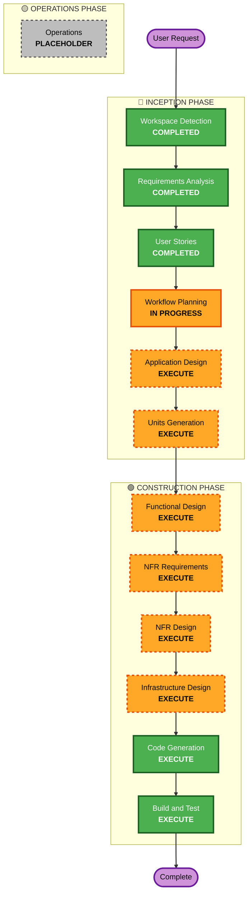

# Execution Plan - コミュ♥外chu

## Detailed Analysis Summary

### Project Type
**Greenfield Project** - 新規開発プロジェクト

### Request Summary
Larry Wallの「怠慢 (Laziness)」を社会実装した、会話のカンペによって人間関係の事故（地雷）を防ぐソーシャル・サバイバルツール。

**コア価値**: ギフトアプリではなく、アイスブレイクカンペとNG話題回避がメイン機能。Amazonギフト提案はマネタイズのための「ついで」要素。

### Change Impact Assessment

#### User-facing changes: YES
- **圧ゼロUI**: ワンタップ・スワイプ操作のみ、文字入力なし
- **手書き風カンペ表示**: スケッチブック風デザイン
- **「よきに」決済**: 商品詳細ページへの直接遷移で思考停止購入（Amazon 1-Click機能に委ねる）
- **ゆるふわAD人格**: 「〜っすね」語尾、保身優先の振る舞い

#### Structural changes: YES
- **サーバーレスアーキテクチャ**: AWS Lambda + API Gateway + DynamoDB
- **AI統合**: Amazon Nova（Bedrock）でマルチモーダル解析
- **通知システム**: EventBridge + Lambda + FCM

#### Data model changes: YES
- **DynamoDB設計**: User、Target、Episode、Feedbackエンティティ
- **非構造化データ**: スクショ、音声メモ、感情タグ
- **時系列データ**: 返報タイミング計算（24時間、2〜3週間）

#### API changes: YES
- **新規API**: 撮れ高報告、カンペ生成、スワイプフィードバック、返報通知
- **認証API**: Amazon Cognito + Google/LINEフェデレーション
- **商品リンク生成**: PA-API不使用、AD（Bedrock）がASIN選択 → 商品詳細ページURL（アソシエイトリンク）生成

#### NFR impact: YES
- **セキュリティ**: Cognito認証、DynamoDB暗号化、IAMロール
- **パフォーマンス**: LLMの推論や解析において、ユーザーの「待たされている感（UXの阻害）」を最小限に抑える、自然なテンポで稼働すること
- **スケーラビリティ**: サーバーレスで自動スケーリング

### Risk Assessment
- **Risk Level**: **Medium**
  - マルチモーダルAI統合の複雑性
  - 社会的マナータイミング制御の実装難易度
  - AD人格プロンプトの調整リスク
- **Rollback Complexity**: **Easy**
  - サーバーレスアーキテクチャで容易にロールバック可能
  - DynamoDBのバックアップ・リストア機能
- **Testing Complexity**: **Moderate**
  - Bedrock統合テスト
  - タイミング計算ロジックのユニットテスト
  - E2Eユーザージャーニーテスト

### Amazon商品リンクの実装方針（重要）

**PA-API完全除外**: Amazon Product Advertising API（PA-API）の利用は完全にスコープ外とします。

**実装方式（全フェーズ統一）**:
1. **AD（Bedrock）がASIN選択**: プロンプトエンジニアリングにより、ADが相手の状況に合わせて適切な商品のASIN（Amazon Standard Identification Number）を選択
2. **商品詳細ページURL生成**: バックエンドで選択されたASINを使用し、ASIN指定の商品詳細ページ（アソシエイトリンク）URLを生成
   - 例: `https://www.amazon.co.jp/dp/B0XXXXXX?tag=associate-id`
3. **UIに表示**: 生成されたURLを「よきに」ボタンに紐付けてフロントエンドに渡す

**UX設計**:
- ユーザーの「摩擦ゼロ体験」は、Amazon側の『今すぐ買う（1-Click）』機能に委ねる
- 1-Click設定済みユーザーは商品詳細ページで1タップで購入完了
- 未設定ユーザーも「カートに入れる」ボタンが目立つ位置に配置されている

**保守性の考慮**:
- Amazon Remote Cart URLはAmazonのセキュリティ仕様変更に弱く、保守性が極めて低い
- 商品詳細ページ方式は安定性が高く、全フェーズ（MVP・決勝）で採用

**メリット**:
- API制限・認証の回避
- シンプルな実装（複雑な商品検索APIなし）
- 高い保守性（Amazonの仕様変更に強い）
- 「よきにボタン」による思考停止体験を実現

**制約**:
- リアルタイム商品検索は不可（ADが事前知識から選択）
- 商品の在庫状況・価格のリアルタイム確認は不可

---

## Workflow Visualization

### Text-Based Workflow

```
INCEPTION PHASE (Blue)
├─ [COMPLETED] Workspace Detection
├─ [COMPLETED] Requirements Analysis
├─ [COMPLETED] User Stories
├─ [IN PROGRESS] Workflow Planning
├─ [EXECUTE] Application Design
└─ [EXECUTE] Units Generation

CONSTRUCTION PHASE (Green)
├─ [EXECUTE] Functional Design (per-unit)
├─ [EXECUTE] NFR Requirements (per-unit)
├─ [EXECUTE] NFR Design (per-unit)
├─ [EXECUTE] Infrastructure Design (per-unit)
├─ [EXECUTE] Code Generation (per-unit, ALWAYS)
└─ [EXECUTE] Build and Test (ALWAYS)

OPERATIONS PHASE (Yellow)
└─ [PLACEHOLDER] Operations
```

### Mermaid Diagram



---

## Phases to Execute

### 🔵 INCEPTION PHASE

- [x] **Workspace Detection** - COMPLETED
  - **Status**: グリーンフィールドプロジェクトと判定
  
- [x] **Requirements Analysis** - COMPLETED
  - **Status**: 包括的な要件定義完了（MVP + 決勝用スコープ）
  
- [x] **User Stories** - COMPLETED
  - **Status**: 18ストーリー作成（P0: 12, P1: 3, P2: 3）
  
- [x] **Workflow Planning** - IN PROGRESS
  - **Status**: 実行計画作成中

- [ ] **Application Design** - **EXECUTE**
  - **Rationale**: 新規コンポーネント設計が必要
    - Frontend: React UI（手書き風カンペ（スケッチブック風）、スワイプジェスチャー、よきにボタン）
    - Backend: API Gateway + Lambda（撮れ高報告、カンペ生成、返報通知）
    - AI Integration: Bedrock（マルチモーダル解析、カンペ生成、AD人格）
    - Data: DynamoDB（User、Target、Episode、Feedback）
  - **Depth**: Standard（新規システムのため標準的な設計深度）

- [ ] **Units Generation** - **EXECUTE**
  - **Rationale**: 複数ユニットへの分割が必要
    - Unit-UI: フロントエンド実装（デザイナー担当）
    - Unit-AD: プロンプトエンジニアリング（企画担当）
    - Unit-DB: DynamoDB設計・CRUD実装（AWSエンジニアA担当）
    - Unit-Integration: API・ワークフロー構築（AWSエンジニアB担当）
  - **Depth**: Standard（4ユニット、並行開発戦略あり）

---

### 🟢 CONSTRUCTION PHASE

**Note**: 以下のステージは各ユニットごとに実行されます。

- [ ] **Functional Design** - **EXECUTE** (per-unit)
  - **Rationale**: 新規データモデルとビジネスロジックが必要
    - DynamoDBスキーマ設計（User、Target、Episode、Feedback）
    - 返報タイミング計算ロジック（24時間、2〜3週間）
    - スワイプフィードバックロジック
  - **Depth**: Standard（新規システムのため標準的な設計深度）

- [ ] **NFR Requirements** - **EXECUTE** (per-unit)
  - **Rationale**: セキュリティ、パフォーマンス、スケーラビリティ要件あり
    - Security Baseline Extension適用
    - AI応答時間5秒以内
    - 画像解析10秒以内
    - サーバーレス自動スケーリング
  - **Depth**: Standard（Security Baseline適用のため標準深度）

- [ ] **NFR Design** - **EXECUTE** (per-unit)
  - **Rationale**: NFR要件を実装パターンに落とし込む必要あり
    - Cognito認証フロー設計
    - DynamoDB暗号化設定
    - Lambda最適化（メモリ、タイムアウト）
    - EventBridge通知パターン
  - **Depth**: Standard（Security Baseline適用のため標準深度）

- [ ] **Infrastructure Design** - **EXECUTE** (per-unit)
  - **Rationale**: AWSインフラ設計が必要
    - Amplify Hosting設定
    - API Gateway + Lambda構成
    - DynamoDB設計
    - Cognito + Google/LINEフェデレーション
    - EventBridge + FCM通知
  - **Depth**: Standard（サーバーレスアーキテクチャの標準設計）

- [ ] **Code Generation** - **EXECUTE** (per-unit, ALWAYS)
  - **Rationale**: 実装計画とコード生成が必須
    - Part 1: Planning（詳細コード生成計画）
    - Part 2: Generation（実際のコード生成）
  - **Depth**: Standard（新規システムの標準実装）

- [ ] **Build and Test** - **EXECUTE** (ALWAYS)
  - **Rationale**: ビルド・テスト手順書作成が必須
    - ビルド手順書
    - ユニットテスト手順書
    - 統合テスト手順書（Bedrock、DynamoDB連携）
    - E2Eテスト手順書（ユーザージャーニー）
  - **Depth**: Standard（新規システムの標準テスト）

---

### 🟡 OPERATIONS PHASE

- [ ] **Operations** - **PLACEHOLDER**
  - **Rationale**: 将来のデプロイ・監視ワークフロー用プレースホルダー
  - **Status**: 現在はBuild and Testで完結

---

## Unit Development Strategy

### Unit分割
1. **Unit-UI** (Frontend)
   - 担当: デザイナー
   - 技術: React + CSS
   - 成果物: 手書き風UI、スワイプジェスチャー、よきにボタン
   - **重要**: バックエンドAPIの完成を待たず、モックデータ（ダミーJSON等）を用いてUIと画面遷移を先行して完成させること

2. **Unit-AD** (AI Integration)
   - 担当: 企画/プロンプトエンジニア
   - 技術: Amazon Nova (Bedrock)
   - 成果物: カンペ生成、ナレッジ抽出、AD人格プロンプト、ASIN選択ロジック

3. **Unit-DB** (Backend - Data)
   - 担当: AWSエンジニアA
   - 技術: DynamoDB + Lambda
   - 成果物: テーブル設計、CRUD API

4. **Unit-Integration** (Backend - Orchestration)
   - 担当: AWSエンジニアB
   - 技術: API Gateway + Lambda + EventBridge
   - 成果物: API統合、通知ワークフロー、商品詳細ページURL（アソシエイトリンク）生成

### 並行開発戦略
- **フェーズ1**: Unit-UI + Unit-AD（先行実装）
- **フェーズ2**: Unit-DB + Unit-Integration（後続実装）

---

## Estimated Timeline

### INCEPTION Phase
- Application Design: 1-2日
- Units Generation: 1日
- **小計**: 2-3日

### CONSTRUCTION Phase (per-unit)
- Functional Design: 1日
- NFR Requirements: 0.5日
- NFR Design: 0.5日
- Infrastructure Design: 1日
- Code Generation: 2-3日
- **小計（per-unit）**: 5-6日

### CONSTRUCTION Phase (全体)
- 4ユニット × 5-6日 = 20-24日（並行開発で短縮可能）
- Build and Test: 2-3日
- **小計**: 22-27日（並行開発で15-18日に短縮可能）

### 合計
- **逐次実行**: 24-30日
- **並行開発**: 17-21日

---

## Success Criteria

### Primary Goal
MVP（予選）スコープの完全実装：Scene 1〜5（撮れ高報告、会話サバイバルカンペ、パフォーマンス、返報性ハック、認証）

### Key Deliverables
1. **Frontend**: React UI（手書き風カンペ（スケッチブック風）、スワイプ、よきにボタン）
2. **Backend**: API Gateway + Lambda + DynamoDB
3. **AI Integration**: Amazon Nova（Bedrock）カンペ生成
4. **Authentication**: Cognito + Google/LINEフェデレーション
5. **Notification**: EventBridge + Lambda + FCM

### Quality Gates
1. **ユーザビリティ**: 文字入力なし、ワンタップ操作のみ
2. **AI応答時間**: LLMの推論や解析において、ユーザーの「待たされている感（UXの阻害）」を最小限に抑える、自然なテンポで稼働すること
3. **セキュリティ**: Security Baseline Extension準拠
4. **テスト**: ユニットテスト、統合テスト、E2Eテスト完了

### MVP（予選）Success Metrics

**【ビジネス・UX軸】**
- コア機能（Scene 1〜5）が検証可能なレベルで実装され、開発チームまたは少数のテスターの手によって「AIに丸投げできる思考停止のUX」が成立していることが確認できること
- テストユーザーが「自分で考えるよりADに任せた方が楽」と感じ、提案を受け入れる（思考停止の立証）

**【システム・技術軸】**
- デモ環境にて、Scene 1〜5のUIとAI連携が稼働する
- LLMの推論や解析において、ユーザーの「待たされている感（UXの阻害）」を最小限に抑える、自然なテンポで稼働すること

### 決勝用フルスコープ Success Metrics

**【ビジネス・UX軸】**
- ユーザーが内容を確認せずとも「任せておけば事故らない」という絶対的な信頼（完全な思考停止）が成立する
- **実ユーザーによる受容率の検証（定量的・定性的エビデンス）**: 開発チーム以外のユーザー（友人・同僚等）にシステムを継続試用してもらい、提案されたカンペやギフトに対する「スワイプ反応（受容率）」を収集し、高い受容率を得ること
- **社会的評価の向上と事故防止のヒアリング検証**: 利用ユーザーに対し、「周囲からの評価が上がった（気が利く人だと思われた）か？」「人間関係の事故（地雷）を防げたと感じたか？」というヒアリングを実施し、高い肯定的な回答率（社会的サバイバルの成功）を得ること

**【システム・技術軸】**
- AWS上でマルチモーダル解析（LINEスクショ、音声入力）からスケジュール通知まで、一連のアーキテクチャが人手介入なしで完全自律稼働する
- 「Googleアカウント連携（カレンダー等の基本的な予定やメール）」と「Amazon連携（商品ページ遷移）」などの外部連携が遅滞なく稼働すること

---

## Next Steps

1. ✅ Workflow Planning完了確認
2. → Application Design開始
3. → Units Generation開始
4. → Construction Phase（各ユニット）
5. → Build and Test
6. → MVP完成

