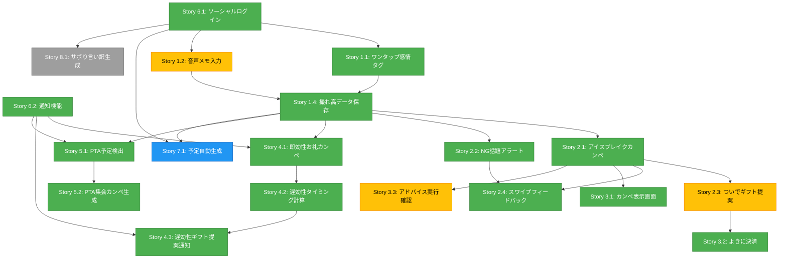

# ユーザーストーリー - コミュ♥外chu

## ストーリー整理方針
- **優先度順**: MVP必須機能 → MVP拡張機能 → 決勝用機能
- **粒度**: 技術レイヤー（Frontend/Backend/AI Integration）別の中粒度
- **受容基準**: 簡易版（Given-When-Then形式で1〜2個）

---

# MVP必須機能（Scene 1〜5）

## Epic 1: 撮れ高報告（Scene 1）

### Story 1.1: ワンタップ感情タグ入力（Frontend）
**As a** 極度の面倒くさがりのユーザー  
**I want to** 予定終了後、ワンタップで感情タグ（🤒 体調悪そう、😊 元気そう、😰 悩んでそう等）を記録したい  
**So that** 文字入力なしで相手の状態を記録できる

**Acceptance Criteria:**
- **Given** 予定終了後にADから「お疲れーっす！今日の撮れ高ポチッとしといてくださーい」と通知が来る
- **When** ユーザーが感情タグ（絵文字ボタン）をワンタップする
- **Then** 感情タグがDynamoDBに保存され、「保存しました〜」とADが確認メッセージを表示する

**Technical Layer:** Frontend (React)  
**Priority:** P0 (MVP必須)  
**Persona:** ターゲットユーザー（健太）、AD

---

### Story 1.2: 音声メモ入力（Frontend + AI Integration）
**As a** 極度の面倒くさがりのユーザー  
**I want to** 短い音声メモ（「腰痛いらしい」等）を録音して記録したい  
**So that** 文字入力なしで詳細情報を記録できる

**Acceptance Criteria:**
- **Given** 撮れ高報告画面で音声メモボタンが表示されている
- **When** ユーザーが音声メモボタンをタップして短いメモを録音する
- **Then** 音声がAmazon Nova（Bedrock）でテキスト化され、DynamoDBに保存される

**Technical Layer:** Frontend (React) + AI Integration (Bedrock)  
**Priority:** P1 (MVP拡張)  
**Persona:** ターゲットユーザー（健太）、AD


---

### Story 1.4: 撮れ高データ保存（Backend）
**As a** システム  
**I want to** ユーザーが入力した撮れ高データ（感情タグ、音声メモ、スクショ解析結果）をDynamoDBに保存したい  
**So that** 後でカンペ生成に利用できる

**Acceptance Criteria:**
- **Given** ユーザーが撮れ高データを入力した
- **When** データがAPI Gateway + Lambdaを経由してDynamoDBに送信される
- **Then** DynamoDBのEpisodeテーブルにデータが保存され、ユーザーIDとターゲット人物IDに紐づく

**Technical Layer:** Backend (API Gateway + Lambda + DynamoDB)  
**Priority:** P0 (MVP必須)  
**Persona:** システム

---

## Epic 2: 会話サバイバル・カンペの提示（Scene 2）

### Story 2.1: アイスブレイクと気遣いの一言カンペ（AI Integration + Frontend）
**As a** 極度の面倒くさがりのユーザー  
**I want to** 次回の予定直前に、相手の直近の状況から生成された「完璧な第一声」のカンペを受け取りたい  
**So that** 会った瞬間に何を言うべきか考えずに、相手に「自分のことを覚えてくれている」と錯覚させられる

**Acceptance Criteria:**
- **Given** 次回の予定が近づいており、過去のエピソード（例: 「腰痛いらしい」）がDynamoDBに保存されている
- **When** ADが過去のエピソードをDynamoDBから取得し、Amazon Nova（Bedrock）でアイスブレイクのカンペを生成する
- **Then** 「とりあえずこれ読んどいてくださーい」と手書き風UIでカンペが表示される（例: 「『腰の調子、どうっすか？』って聞いとけばOKっす」）

**Technical Layer:** AI Integration (Bedrock) + Frontend (React)  
**Priority:** P0 (MVP必須)  
**Persona:** ターゲットユーザー（健太）、AD

---

### Story 2.2: NG話題（地雷）回避アラート（AI Integration + Frontend）
**As a** 極度の面倒くさがりのユーザー  
**I want to** 絶対に振ってはいけない話題（離婚、ペットの死等）を赤字で警告してほしい  
**So that** 社会的な死（地雷を踏むこと）を防げる

**Acceptance Criteria:**
- **Given** 過去のエピソードに「最近離婚した」「ペットが亡くなった」等のNG話題が含まれている
- **When** ADがNG話題を検出する
- **Then** カンペの上部に赤字で「⚠️ 絶対に聞いちゃダメ：『奥さん元気？』『犬は？』」と警告が表示される

**Technical Layer:** AI Integration (Bedrock) + Frontend (React)  
**Priority:** P0 (MVP必須)  
**Persona:** ターゲットユーザー（健太）、AD

---

### Story 2.3: ついでギフトの提案（AI Integration + Frontend）
**As a** 極度の面倒くさがりのユーザー  
**I want to** カンペの下部に「おまけ」としてAmazonギフト提案を受け取りたい  
**So that** さらに好感度を上げたい場合に、思考停止でギフトを手配できる

**Acceptance Criteria:**
- **Given** アイスブレイクカンペが生成された
- **When** ADが相手の状態（例: 腰痛）に合わせてギフト（例: きき湯 ファインヒート）を提案する
- **Then** カンペの下部に「ついでにこれ買っとけばさらに安泰っす👍」とAmazon商品詳細ページURL（ASINベースのアソシエイトリンク）付きで表示される

**Technical Layer:** AI Integration (Bedrock) + Frontend (React)  
**Priority:** P1 (MVP拡張)  
**Note:** Amazon PA-APIは利用せず、Bedrockが推奨商品のASINを選択し、ASIN指定の商品詳細ページ（アソシエイトリンク）への遷移で統一。ユーザーの「摩擦ゼロ体験」は、Amazon側の『今すぐ買う（1-Click）』機能に委ねる。マネタイズのための「ついで（オプション）」要素。  
**Persona:** ターゲットユーザー（健太）、AD

---

### Story 2.4: スワイプフィードバック（興味あり/なし）（Frontend + Backend）
**As a** 極度の面倒くさがりのユーザー  
**I want to** カンペやギフト提案に対してTinder風スワイプで「興味あり/なし」を反応したい  
**So that** 次回のAD提案精度が向上する

**Acceptance Criteria:**
- **Given** カンペまたはギフト提案が表示されている
- **When** ユーザーが右スワイプ（興味あり）または左スワイプ（興味なし）する
- **Then** フィードバックがDynamoDBに保存され、ADの提案精度が向上する

**Technical Layer:** Frontend (React + react-spring) + Backend (DynamoDB)  
**Priority:** P0 (MVP必須)  
**Persona:** ターゲットユーザー（健太）、AD

---

## Epic 3: パフォーマンス（Scene 3）

### Story 3.1: カンペ表示画面（手書き風UI）（Frontend）
**As a** 極度の面倒くさがりのユーザー  
**I want to** カンペを手書き風のスケッチブック風UIで表示してほしい  
**So that** 「圧ゼロ」の心地よい体験ができる

**Acceptance Criteria:**
- **Given** カンペが生成されている
- **When** ユーザーがカンペ表示画面を開く
- **Then** 手書き風フォント・スケッチブック風デザインでカンペが表示される

**Technical Layer:** Frontend (React + CSS)  
**Priority:** P0 (MVP必須)  
**Persona:** ターゲットユーザー（健太）、AD

---

### Story 3.2: 思考停止の「よきに」決済（Frontend）
**As a** 極度の面倒くさがりのユーザー  
**I want to** 「よきに」ボタンをワンタップするだけで、Amazon商品詳細ページに遷移したい  
**So that** 商品を探す手間を完全に省き、ADが選んだ商品に直接アクセスして、最小限の意識で保身（ギフト手配）を完了できる

**Acceptance Criteria:**
- **Given** ギフト提案（Amazonリンク）が表示されている
- **When** ユーザーが「よきに」ボタン（または「よきに計らえ」ボタン）をタップする
- **Then** Amazon商品詳細ページに直接遷移する（商品を探す手間を完全に省く）

**Technical Layer:** Frontend (React)  
**Priority:** P0 (MVP必須)  
**Note:** ASIN指定の商品詳細ページ（アソシエイトリンク）への遷移で統一。Bedrockが推奨商品のASINを選択し、商品詳細ページURLを生成（例: `https://www.amazon.co.jp/dp/B0XXXXXX?tag=associate-id`）。ユーザーの「摩擦ゼロ体験」は、Amazon側の『今すぐ買う（1-Click）』機能に委ねる。Amazon PA-APIは利用しない。Amazon Remote Cart URLはセキュリティ仕様変更に弱いため、全フェーズで商品詳細ページ方式を採用。  
**Persona:** ターゲットユーザー（健太）、AD

---

### Story 3.3: アドバイス実行確認（Frontend）
**As a** 極度の面倒くさがりのユーザー  
**I want to** アドバイス系の行動提案に対して「了解」ボタンをタップしたい  
**So that** ADに「実行した」ことを伝え、次回の提案精度を向上させる

**Acceptance Criteria:**
- **Given** アドバイス系の行動提案（例: 「『最近どう？』って軽く聞いとけばOKっす」）が表示されている
- **When** ユーザーが「了解」ボタンをタップする
- **Then** 「了解しました〜」とADが確認メッセージを表示し、実行フラグがDynamoDBに保存される

**Technical Layer:** Frontend (React) + Backend (DynamoDB)  
**Priority:** P1 (MVP拡張)  
**Persona:** ターゲットユーザー（健太）、AD

---

## Epic 4: 返報性ハック（二段階返報ロジック）（Scene 4）

### Story 4.1: 第一段階：即効性お礼カンペ通知（24時間以内）（AI Integration + Backend）
**As a** 極度の面倒くさがりのユーザー  
**I want to** 「もらった」エピソードから24時間以内に、感謝のLINEを送るためのカンペテキストをADが自動生成して通知してほしい  
**So that** 「気が利かない人」認定される前に、秒でお礼を伝えて「マメな人」として評価される

**Acceptance Criteria:**
- **Given** ユーザーが「叔父さんからお酒をもらった」というエピソードを記録した
- **When** 事象発生から24時間以内に、最初のお礼メッセージ（カンペ）の送付タイミングが到来する
- **Then** ADが「お疲れーっす！昨日の件、とりあえず今日はお礼のLINEだけ送っときましょ！お返しは今すぐだとガッツいてる感（事務的）出ちゃうんで、時期が来たらまたリマインドしますね👍『この前のお酒、めっちゃ美味しかったです！ありがとうございました』」と通知する

**Technical Layer:** AI Integration (Bedrock) + Backend (Lambda + EventBridge)  
**Priority:** P0 (MVP必須)  
**Note:** ADの先回りロジック「鉄は熱いうちに打て」を実装。ただし、ギフトは「早すぎて事務的」にならないよう、第二段階まで待つことをユーザーに説明する。  
**Persona:** ターゲットユーザー（健太）、AD

---

### Story 4.2: 第二段階：遅効性ギフト提案タイミング計算（2〜3週間後、または次回予定直前）（Backend）
**As a** システム  
**I want to** 過去の「もらった」エピソードから、社会的マナーとして最適なギフト返報タイミングを自動計算したい  
**So that** 「早すぎて事務的」にならず、「遅すぎて失礼」にもならない完璧なタイミングでお返し提案ができる

**Acceptance Criteria:**
- **Given** ユーザーが「叔父さんからお酒をもらった」というエピソードを記録している
- **When** 事象発生から2〜3週間後、または次にその人と会う予定の直前のタイミングが到来する
- **Then** システムが「今ならマナー的に完璧なタイミング」と判断し、通知を準備する

**Technical Layer:** Backend (Lambda)  
**Priority:** P0 (MVP必須)  
**Note:** 「マナーの時差（遅延評価）」をシステムが完全に管理。ユーザーは一切の判断を放棄できる。  
**Persona:** システム

---

### Story 4.3: 第二段階：遅効性ギフト提案通知（2〜3週間後、または次回予定直前）（Backend + Frontend）
**As a** 極度の面倒くさがりのユーザー  
**I want to** 社会的マナーとして最適なタイミング（2〜3週間後、または次回予定直前）で自動的にお返し提案通知を受け取りたい  
**So that** 「早すぎて事務的」にも「遅すぎて失礼」にもならず、完璧なタイミングで返報できる

**Acceptance Criteria:**
- **Given** 返報タイミング（2〜3週間後、または次回予定直前）が到来した
- **When** EventBridge + Lambda + FCMが通知を送信する
- **Then** ユーザーのスマホに「あ、そういえば前にお酒もらった件、そろそろお返ししとく（または次に会う時に渡す）時期っすね。今ならマナー的に完璧なタイミングなんで、これポチっときましょ。叔父さん好きそうな『塩辛』の限定品（Amazonリンク）見つけといたっす」と通知が届く

**Technical Layer:** Backend (EventBridge + Lambda + FCM) + Frontend (React)  
**Priority:** P0 (MVP必須)  
**Persona:** ターゲットユーザー（健太）、AD

---

# MVP基盤機能

## Epic 5: PTA集会カンペ（Scene 5）

### Story 5.1: Googleカレンダー連携によるPTA予定検出（Backend + AI Integration）
**As a** ユーザー  
**I want to** Googleカレンダーから「PTA集会」等の予定を自動検出してほしい  
**So that** 手動で予定を入力する手間を省ける

**Acceptance Criteria:**
- **Given** ユーザーがGoogleアカウントでログインし、カレンダー連携を許可している
- **When** ADがGoogleカレンダーから「PTA集会」等の予定を検出する
- **Then** 開始時刻の30分前に「今日のPTA集会、こんな感じで乗り切りましょ〜」と通知が届く

**Technical Layer:** Backend (Google Calendar API + Lambda) + AI Integration (Bedrock)  
**Priority:** P0 (MVP必須)  
**Note:** 位置情報APIは使用せず、カレンダーの日時トリガーのみを使用  
**Persona:** ターゲットユーザー（健太）、AD

---

### Story 5.2: PTA集会カンペ生成（AI Integration + Frontend）
**As a** ユーザー  
**I want to** PTA集会の直前に、過去のエピソードから生成された会話カンペを受け取りたい  
**So that** PTA集会で何を話すべきか考えずに、スムーズに会話できる

**Acceptance Criteria:**
- **Given** PTA集会の予定が30分後に迫っている
- **When** ADが過去のエピソード（PTA関連の人物情報）から会話カンペを生成する
- **Then** 「今日のPTA集会、こんな感じで乗り切りましょ〜『〇〇さん、お子さん元気ですか？』って聞いとけばOKっす」とカンペが表示される

**Technical Layer:** AI Integration (Bedrock) + Frontend (React)  
**Priority:** P0 (MVP必須)  
**Persona:** ターゲットユーザー（健太）、AD

---

## Epic 6: 認証・ユーザー管理

### Story 6.1: ソーシャルログイン（Google/LINE）（Backend + Frontend）
**As a** ユーザー  
**I want to** Google/LINEアカウントでログインしたい  
**So that** 新規アカウント作成の手間を省ける

**Acceptance Criteria:**
- **Given** ログイン画面が表示されている
- **When** ユーザーが「Googleでログイン」または「LINEでログイン」ボタンをタップする
- **Then** Amazon Cognito + Google/LINEフェデレーションでOAuth認証が完了し、ユーザーがアプリにログインする

**Technical Layer:** Backend (Cognito) + Frontend (React)  
**Priority:** P0 (MVP必須)  
**Persona:** ターゲットユーザー（健太）

---

### Story 6.2: 通知機能（EventBridge + Lambda + FCM）（Backend）
**As a** システム  
**I want to** 予定直前や返報タイミングでプッシュ通知を送信したい  
**So that** ユーザーがタイムリーにカンペや提案を受け取れる

**Acceptance Criteria:**
- **Given** 通知送信タイミングが到来した
- **When** EventBridge + Lambdaが通知イベントをトリガーする
- **Then** Firebase Cloud Messaging (FCM)経由でユーザーのスマホにプッシュ通知が届く

**通知タイミング**:
- 予定直前のカンペ通知
- 返報タイミング（24時間以内、2〜3週間後）
- PTA集会等のカレンダー予定直前

**Technical Layer:** Backend (EventBridge + Lambda + FCM)  
**Priority:** P0 (MVP必須)  
**Persona:** システム

---

# 決勝用機能

## Epic 7: 予定自動生成（Scene 0）

### Story 7.1: Googleカレンダー・Gmail・Google Photos連携による予定取得（Backend + AI Integration）
**As a** ユーザー  
**I want to** Googleカレンダー、Gmail、Google Photosから自動的に予定を取得してほしい  
**So that** 手動で予定を入力する手間を省ける

**Acceptance Criteria:**
- **Given** ユーザーがGoogleアカウントでログインし、カレンダー・Gmail・Google Photos連携を許可している
- **When** ADがGoogleカレンダーから予定を取得し、GmailやGoogle Photosから関連情報を解析する
- **Then** 「あ、〇〇さんと会うんすね。カレンダー入れときました〜」と予定とTODOが自動生成される

**Technical Layer:** Backend (Google Calendar API + Gmail API + Google Photos API + Lambda) + AI Integration (Bedrock)  
**Priority:** P2 (決勝用)  
**Note:** 外部連携は「Googleアカウント連携（カレンダー、Gmail、Google Photos）」と「Amazon連携（商品ページ遷移）」に限定  
**Persona:** ターゲットユーザー（健太）、AD

---

## Epic 9: 非機能要件（NFR）- 決勝用のみ

**重要**: このEpicのすべてのストーリーは決勝用（P2）または将来拡張（P3）であり、**MVPでは実装しない**。MVPは機能検証を優先し、非機能要件は最低限のレベルで十分とする。

---

### Story 9.1: AI応答時間の最適化（Performance - 決勝用）

**As a** ユーザー  
**I want to** カンペ生成が5秒以内に完了してほしい  
**So that** 待たされている感なくスムーズに利用できる

**Acceptance Criteria:**
- **Given** ユーザーがカンペ生成をリクエストした
- **When** Bedrockがカンペを生成する
- **Then** P95レスポンスタイムが5秒以内である（MVPは10秒以内で許容）

**最適化手法**:
- Bedrockプロンプトの最適化（トークン数削減）
- 頻繁なカンペパターンのキャッシング（DynamoDB TTL）
- Lambda関数のウォームアップ（Provisioned Concurrency）

**Technical Layer:** AI Integration (Bedrock) + Backend (Lambda)  
**Priority:** P2 (決勝用)  
**Note:** MVPでは10秒以内で許容。決勝用で5秒以内に最適化  
**Persona:** ターゲットユーザー（健太）

---

### Story 9.2: スクショ解析の高速化（Performance - 決勝用）

**As a** ユーザー  
**I want to** スクショ解析が10秒以内に完了してほしい  
**So that** 撮れ高報告がスムーズに完了する

**Acceptance Criteria:**
- **Given** ユーザーがスクショをアップロードした
- **When** Bedrockマルチモーダル機能で解析する
- **Then** P95レスポンスタイムが10秒以内である（MVPは15秒以内で許容）

**最適化手法**:
- 画像圧縮（クライアント側で事前圧縮）
- 並列処理（複数画像の同時解析）
- プロンプト最適化

**Technical Layer:** AI Integration (Bedrock) + Frontend (React)  
**Priority:** P2 (決勝用)  
**Note:** MVPでは15秒以内で許容。決勝用で10秒以内に最適化  
**Persona:** ターゲットユーザー（健太）

---

### Story 9.3: データ暗号化の実装（Security - 決勝用）

**As a** システム管理者  
**I want to** ユーザーの人間関係データを暗号化したい  
**So that** 個人情報が保護される

**Acceptance Criteria:**
- **Given** DynamoDBテーブルが作成されている
- **When** データが保存される
- **Then** at-rest暗号化が有効化されている

**セキュリティ実装**:
- DynamoDB at-rest暗号化（AWS KMS）
- HTTPS通信（in-transit暗号化）
- 機密データのフィールドレベル暗号化（エピソード内容等）

**Technical Layer:** Backend (DynamoDB)  
**Priority:** P2 (決勝用)  
**Note:** MVPではDynamoDB標準暗号化のみ。決勝用でKMS統合  
**Persona:** システム管理者

---

### Story 9.4: API認可の強化（Security - 決勝用）

**As a** システム管理者  
**I want to** ユーザーが自分のデータのみアクセスできるようにしたい  
**So that** 他人のデータが漏洩しない

**Acceptance Criteria:**
- **Given** ユーザーがAPIをリクエストした
- **When** API Gateway Lambda Authorizerが認可チェックを実行する
- **Then** ユーザーは自分のデータのみアクセス可能である

**認可実装**:
- Lambda Authorizer（JWTトークン検証 + ユーザーID抽出）
- DynamoDBクエリでユーザーIDフィルタリング
- IAMロールによる最小権限の原則

**Technical Layer:** Backend (API Gateway + Lambda)  
**Priority:** P2 (決勝用)  
**Note:** MVPでは基本的な認証のみ。決勝用で認可強化  
**Persona:** システム管理者

---

### Story 9.5: Bedrock障害時のフォールバック（Error Handling - 決勝用）

**As a** システム  
**I want to** Bedrock障害時にデフォルトカンペを表示したい  
**So that** ユーザー体験が完全に停止しない

**Acceptance Criteria:**
- **Given** Bedrockがタイムアウトまたはエラーを返す
- **When** カンペ生成がリクエストされる
- **Then** デフォルトカンペ（「最近どうっすか？」等）が表示される

**エラーハンドリング実装**:
```typescript
try {
  const kanpe = await bedrockClient.generateKanpe(context);
} catch (error) {
  // フォールバック: デフォルトカンペ
  const kanpe = getDefaultKanpe();
  logger.warn('Bedrock fallback triggered', { error });
}
```

**デフォルトカンペ例**:
- 「最近どうっすか？って聞いとけばOKっす」
- 「お元気っすか？って軽く聞いときましょ」

**Technical Layer:** Backend (Lambda) + Frontend (React)  
**Priority:** P2 (決勝用)  
**Note:** MVPではエラー時にエラーメッセージ表示のみ。決勝用でフォールバック実装  
**Persona:** システム

---

### Story 9.6: DynamoDB障害時のリトライ（Error Handling - 決勝用）

**As a** システム  
**I want to** DynamoDB障害時に自動リトライしたい  
**So that** 一時的な障害でデータ保存が失敗しない

**Acceptance Criteria:**
- **Given** DynamoDBが一時的なエラーを返す
- **When** データ保存がリクエストされる
- **Then** 最大3回まで自動リトライされる

**リトライロジック実装**:
```typescript
const dynamoClient = new DynamoDBClient({
  maxAttempts: 3,
  retryMode: 'adaptive',
  retryStrategy: exponentialBackoff
});
```

**Technical Layer:** Backend (Lambda + DynamoDB)  
**Priority:** P2 (決勝用)  
**Note:** MVPではリトライなし。決勝用でリトライロジック実装  
**Persona:** システム

---

### Story 9.7: 通知送信失敗時のリトライ（Error Handling - 決勝用）

**As a** システム  
**I want to** FCM通知送信失敗時に自動リトライしたい  
**So that** 重要な通知が確実に届く

**Acceptance Criteria:**
- **Given** FCM通知送信が失敗した
- **When** 通知送信がリクエストされる
- **Then** 最大3回まで自動リトライされ、失敗時はDLQ（Dead Letter Queue）に送信される

**リトライロジック実装**:
- EventBridge + Lambda + SQS DLQ
- 指数バックオフ（1秒、2秒、4秒）
- DLQからの手動再送機能

**Technical Layer:** Backend (EventBridge + Lambda + FCM + SQS)  
**Priority:** P2 (決勝用)  
**Note:** MVPではリトライなし。決勝用でリトライ + DLQ実装  
**Persona:** システム

---

### Story 9.8: CloudWatch監視ダッシュボード（Observability - 決勝用）

**As a** システム管理者  
**I want to** システムのパフォーマンスとエラー率をリアルタイムで監視したい  
**So that** 問題を早期に検出できる

**Acceptance Criteria:**
- **Given** CloudWatch Dashboardが作成されている
- **When** システムが稼働している
- **Then** レスポンスタイム、エラー率、スロットリング率がリアルタイムで表示される

**監視項目**:
- Lambda実行時間（P50/P95/P99）
- Bedrock応答時間（カスタムメトリクス）
- DynamoDB応答時間
- API Gatewayエラー率
- FCM通知送信成功率

**Technical Layer:** Backend (CloudWatch)  
**Priority:** P2 (決勝用)  
**Note:** MVPでは基本的なCloudWatch Logsのみ。決勝用でダッシュボード実装  
**Persona:** システム管理者

---

### Story 9.9: X-Ray分散トレーシング（Observability - 将来拡張）

**As a** システム管理者  
**I want to** エンドツーエンドのレイテンシを分析したい  
**So that** ボトルネックを特定できる

**Acceptance Criteria:**
- **Given** X-Rayが有効化されている
- **When** ユーザーがカンペ生成をリクエストする
- **Then** Frontend → API Gateway → Lambda → Bedrock → DynamoDBの全経路がトレースされる

**トレーシング実装**:
- Lambda関数でX-Ray SDK有効化
- カスタムセグメント（Bedrock呼び出し、DynamoDBクエリ）
- サービスマップ可視化

**Technical Layer:** Backend (X-Ray)  
**Priority:** P3 (将来拡張)  
**Note:** 決勝用でも実装しない。将来の最適化時に検討  
**Persona:** システム管理者

---

### Story 9.10: 人格一貫性スコアの監視（Quality - 決勝用）

**As a** システム管理者  
**I want to** AI人格の一貫性スコアを監視したい  
**So that** 人格崩壊を早期に検出できる

**Acceptance Criteria:**
- **Given** Bedrock応答がCloudWatch Logsに記録されている
- **When** CloudWatch Logs Insightsでクエリを実行する
- **Then** 人格一貫性スコア（語尾一致率、禁止ワード検出率）が表示される

**監視クエリ例**:
```
fields @timestamp, response
| filter response like /頑張りましょう|ちゃんと|しっかり/
| stats count() as violation_count by bin(5m)
```

**アラート設定**:
- 禁止ワード検出率が5%を超えた場合にSNS通知
- 語尾不一致率が10%を超えた場合にSNS通知

**Technical Layer:** Backend (CloudWatch Logs Insights + SNS)  
**Priority:** P2 (決勝用)  
**Note:** MVPでは手動確認のみ。決勝用で自動監視実装  
**Persona:** システム管理者

---

# 拡張スコープ（決勝フルスコープ後の将来拡張）

## Epic 8: サボりの免罪符（Scene 6）

### Story 8.1: 位置情報・天気連携によるサボり言い訳生成（Backend + AI Integration）
**As a** ユーザー  
**I want to** 位置情報と天気情報を組み合わせて、「サボり」の言い訳を自動生成してほしい  
**So that** 罪悪感なくサボれる

**Acceptance Criteria:**
- **Given** ユーザーの現在地と天気情報が取得されている
- **When** ADが位置情報と天気情報を組み合わせて言い訳を生成する
- **Then** 「今日は雨だし、体調悪いって言っときましょ〜」と免罪符が表示される

**Technical Layer:** Backend (位置情報API + 天気API + Lambda) + AI Integration (Bedrock)  
**Priority:** P3 (拡張スコープ - 決勝フルスコープ後の将来拡張)  
**Note:** このストーリーは決勝用フルスコープには含まれず、将来の拡張として位置づける  
**Persona:** ターゲットユーザー（健太）、AD

---

# ストーリーサマリー

## 優先度別ストーリー数
- **P0 (MVP必須)**: 14ストーリー
- **P1 (MVP拡張)**: 3ストーリー
- **P2 (決勝用)**: 11ストーリー（1機能 + 10非機能要件）
- **P3 (拡張スコープ)**: 2ストーリー（1機能 + 1非機能要件）
- **合計**: 30ストーリー

## Epic別ストーリー数
- Epic 1: 撮れ高報告（3ストーリー: 1.1, 1.2, 1.4）
- Epic 2: 会話サバイバル・カンペの提示（4ストーリー: 2.1, 2.2, 2.3, 2.4）
- Epic 3: パフォーマンス（3ストーリー: 3.1, 3.2, 3.3）
- Epic 4: 返報性ハック（3ストーリー: 4.1, 4.2, 4.3）
- Epic 5: PTA集会カンペ（2ストーリー: 5.1, 5.2）
- Epic 6: 認証・ユーザー管理（2ストーリー: 6.1, 6.2）
- Epic 7: 予定自動生成（1ストーリー: 7.1）
- Epic 8: サボりの免罪符（1ストーリー: 8.1）
- **Epic 9: 非機能要件（10ストーリー: 9.1〜9.10）** ※決勝用のみ

## 技術レイヤー別ストーリー数
- Frontend (React): 7ストーリー
- Backend (API Gateway + Lambda + DynamoDB): 13ストーリー（+6非機能要件）
- AI Integration (Bedrock): 7ストーリー（+2非機能要件）
- Observability (CloudWatch + X-Ray): 2ストーリー（非機能要件）

## 非機能要件ストーリーの分類

| カテゴリ | ストーリー数 | 優先度 |
|---|---|---|
| Performance（パフォーマンス） | 2 | P2（決勝用） |
| Security（セキュリティ） | 2 | P2（決勝用） |
| Error Handling（エラーハンドリング） | 3 | P2（決勝用） |
| Observability（可観測性） | 2 | P2（決勝用）+ P3（将来） |
| Quality（品質） | 1 | P2（決勝用） |

**重要**: すべての非機能要件ストーリーは**MVPでは実装しない**。MVPは機能検証を優先し、非機能要件は最低限のレベルで十分とする。

## ストーリー依存関係図

### 依存関係の可視化



**凡例**:
- 🟢 緑: P0（MVP必須）
- 🟡 黄: P1（MVP拡張）
- 🔵 青: P2（決勝用）
- ⚫ 灰: P3（拡張スコープ）

### 推奨実装順序

#### フェーズ1: 基盤機能（1-2日）
1. **Story 6.1**: ソーシャルログイン（認証基盤）
2. **Story 6.2**: 通知機能（EventBridge + FCM）

**並行実装可能**: Story 6.1とStory 6.2は独立しているため並行実装可能

---

#### フェーズ2: 撮れ高報告（2-3日）
3. **Story 1.4**: 撮れ高データ保存（Backend - DynamoDB）
4. **Story 1.1**: ワンタップ感情タグ入力（Frontend）
5. **Story 1.2**: 音声メモ入力（Frontend + AI Integration）※P1

**並行実装可能**: Story 1.1とStory 1.2は並行実装可能（どちらもStory 1.4に依存）

**依存関係**:
- Story 1.1, 1.2 → Story 1.4（データ保存APIが必要）
- Story 1.1, 1.2 → Story 6.1（認証が必要）

---

#### フェーズ3: カンペ生成（3-4日）
6. **Story 2.1**: アイスブレイクカンペ（AI Integration）
7. **Story 2.2**: NG話題アラート（AI Integration）
8. **Story 2.4**: スワイプフィードバック（Frontend + Backend）
9. **Story 2.3**: ついでギフト提案（AI Integration）※P1

**並行実装可能**: Story 2.1とStory 2.2は並行実装可能（どちらもStory 1.4に依存）

**依存関係**:
- Story 2.1, 2.2 → Story 1.4（エピソードデータが必要）
- Story 2.4 → Story 2.1, 2.2（カンペが必要）
- Story 2.3 → Story 2.1（カンペ生成ロジックが必要）

---

#### フェーズ4: UI実装（2-3日）
10. **Story 3.1**: カンペ表示画面（Frontend - 手書き風UI）
11. **Story 3.2**: よきに決済（Frontend）
12. **Story 3.3**: アドバイス実行確認（Frontend）※P1

**並行実装可能**: Story 3.1, 3.2, 3.3は並行実装可能（UIコンポーネント）

**依存関係**:
- Story 3.1 → Story 2.1（カンペデータが必要）
- Story 3.2 → Story 2.3（ギフト提案が必要）
- Story 3.3 → Story 2.1（アドバイスデータが必要）

---

#### フェーズ5: 返報性ハック（3-4日）
13. **Story 4.1**: 即効性お礼カンペ通知（AI Integration + Backend）
14. **Story 4.2**: 遅効性タイミング計算（Backend）
15. **Story 4.3**: 遅効性ギフト提案通知（Backend + Frontend）

**並行実装不可**: Story 4.1 → 4.2 → 4.3の順序で実装（依存関係が強い）

**依存関係**:
- Story 4.1 → Story 1.4（エピソードデータが必要）
- Story 4.1 → Story 6.2（通知機能が必要）
- Story 4.2 → Story 4.1（即効性ロジックが必要）
- Story 4.3 → Story 4.2（タイミング計算が必要）

---

#### フェーズ6: PTA集会カンペ（2-3日）
16. **Story 5.1**: PTA予定検出（Backend + Google Calendar API）
17. **Story 5.2**: PTA集会カンペ生成（AI Integration + Frontend）

**並行実装不可**: Story 5.1 → 5.2の順序で実装

**依存関係**:
- Story 5.1 → Story 6.1（Google認証が必要）
- Story 5.1 → Story 6.2（通知機能が必要）
- Story 5.2 → Story 5.1（予定データが必要）
- Story 5.2 → Story 1.4（エピソードデータが必要）

---

#### フェーズ7: 決勝用機能（3-4日）
18. **Story 7.1**: 予定自動生成（Backend + AI Integration）

**依存関係**:
- Story 7.1 → Story 6.1（Google認証が必要）
- Story 7.1 → Story 1.4（エピソードデータ保存が必要）

---

#### フェーズ8: 拡張スコープ（将来）
19. **Story 8.1**: サボり言い訳生成（Backend + AI Integration）

**依存関係**:
- Story 8.1 → Story 6.1（認証が必要）

---

### 並行実装戦略

#### 並行実装可能なストーリーグループ

**グループ1（基盤）**:
- Story 6.1（認証）
- Story 6.2（通知）

**グループ2（撮れ高報告）**:
- Story 1.1（感情タグ）
- Story 1.2（音声メモ）※P1

**グループ3（カンペ生成）**:
- Story 2.1（アイスブレイクカンペ）
- Story 2.2（NG話題アラート）

**グループ4（UI実装）**:
- Story 3.1（カンペ表示画面）
- Story 3.2（よきに決済）
- Story 3.3（アドバイス実行確認）※P1

### クリティカルパス

**MVP完成までのクリティカルパス（最短経路）**:
```
Story 6.1（認証）
  ↓
Story 1.4（データ保存）
  ↓
Story 2.1（カンペ生成）
  ↓
Story 3.1（カンペ表示）
  ↓
Story 4.1（即効性お礼）
  ↓
Story 4.2（タイミング計算）
  ↓
Story 4.3（遅効性ギフト提案）
```

**推定日数**: 15-18日（クリティカルパスのみ）

**並行実装を活用した推定日数**: 12-15日（並行実装グループを活用）

---

## INVEST基準チェック（修正版）

すべてのストーリーは以下のINVEST基準を満たしています：
- ⚠️ **Independent（独立している）**: 一部のストーリーには依存関係が存在するが、依存関係図で明確化されている
- ✅ **Negotiable（交渉可能）**: 受容基準は簡易版で、実装詳細は柔軟に調整可能
- ✅ **Valuable（価値がある）**: すべてのストーリーがユーザー体験またはシステム機能に価値を提供
- ✅ **Estimable（見積もり可能）**: 技術レイヤー別に分割され、見積もりが容易
- ✅ **Small（小さい）**: 中粒度で、1〜3日で実装可能なサイズ
- ✅ **Testable（テスト可能）**: Given-When-Then形式の受容基準でテスト可能

**注**: 「Independent（独立している）」については、完全な独立性ではなく、依存関係を明確化することでINVEST基準を満たしている。
